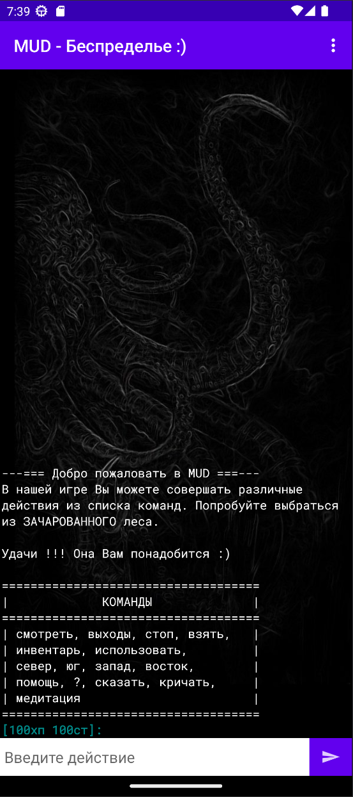
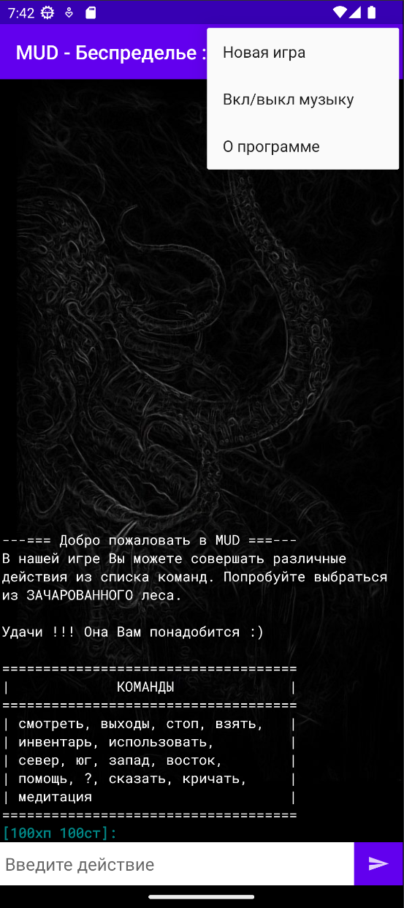
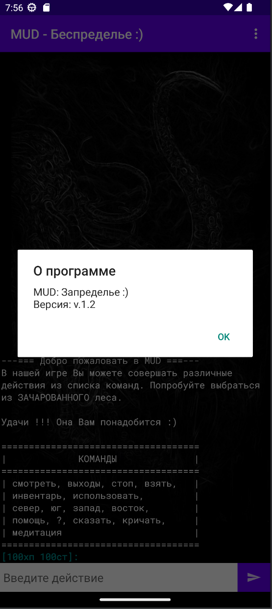

## Название проекта:

MUD: Запределье :)

## Автор:

Полякова Юлия Александровна

## Идея:

Небольшая текстовая игра. Основная цель игрока - выбраться из зачарованного леса. Для управления персонажем в игре используются простые текстовые команды.

## Реализация:

#### Основные классы:

1. *MainActivity* - главная активность приложения. В этом классе создаются приватные переменные с движком игры, текущей настройкой Вкл/выкл звук и названиями настроек приложения.

    Методы (переопределенные):
    * onCreate() - в нем разметка подключается к активности, отключается ночная тема, сохраняются ссылки на элементы разметки, включается скролинг в textView, создается обработчик на кнопку отправки команд, запускается игра
    * onPause() - сохраняются настройки, принудительно отключается звук, т.к. приложение не активно
    * onResume() - считывается настройка, если нужно, активируется музыка
    * onStop() - сохраняет настройку музыки
    * onCreateOptionsMenu(Menu menu) - на создание меню
    * onOptionsItemSelected(MenuItem item) - обрабатывает выбранный пункт меню
   
    Другие методы:
    * startGame() - пересоздание всех элементов, разблокировка управления, сброс состояния и очистка экрана
    * createOneButtonAlertDialog(String title, String content) - выводит диалоговое окно "О программе"
    

2. *GameProcessor* - движок игры. Хранит текущее положение игрока, его характеристики и инвентарь. Создаются константы некоторых строк и приватные переменные класса. В конструкторе объявляется context (доступ к ресурсам приложения).

    Методы:
    * appendText() - добавляет игровой текст основным цветом
    * appendColoredText() - добавляет текст действия и характеристики игрока особым цветом.
    * startGame() - запуск игры (сброс значений, отрисовка приветствия)
    * endGame() - завершение игры (остановка звуков)
    * isEndGame() - проверка, завершена ли игра
    * getState() - возвращает строку с описанием характеристик игрока
    * getGreetings() - возвращает блок приветствия для начала игры
    * getHelp() - возвращает подсказку
    * process() - обработка следующей команды игрока
    * next() - формирует игровой ответ на комманду
    * drop() - изменяет характеристики вещей (камень, бревно) при выпадении из инвентаря
    * playSound() - запускает воспроизведение музыки
    * mute() - вкл/выкл возпроизведение звуков в приложении
    * setMusic() - запоминает текущий, воспроизводимый звук
    * getMusic() - возвращает текущий, воспроизводимый звук

3. *PreferenceHelper* - класс для управления настройками приложения.

    Методы:
    * putBoolean() - устанавливает boolean настройку по ключу
    * getBoolean() - возвращает boolean знаяение из shared-preference по ключу
    * putInt() - устанавливает int настройку по ключу
    * getInt() - возвращает int знаяение из shared-preference по ключу

#### Добавленные ресурсы:

1. В drawable добавлена картинка с фоном и картинка на кнопке.
2. В font находится шрифр приложения.
3. В layout основная активность.
4. В menu активность меню.
5. В mipmap изменена иконка приложения.
6. В raw находятся звуки.
7. В values изменены некоторые строки, цвета. Изменен цвет в темной теме.

## Пользовательский интерфейс:

